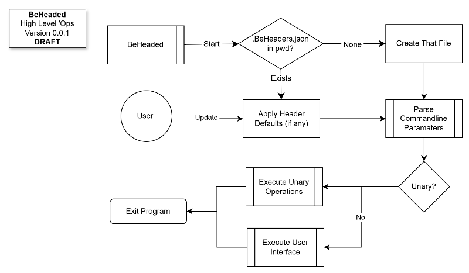

# BeHeaded
BeHeaded is a small Python console utility to C.R.U.D. standardized header comments at the top of Python scripts. Both a single - as well as multiple files - can be 'headed at the same time.

## Yet Another `YouRube` Show ;-)
Yea, wellll - here is [the 'vid](https://youtu.be/DCS4HoZB0Fg).

## 'Ops Overview


## 'Da Rules
- Parse header comments at top of Python scripts (preserve shebang).
- Recognize keys of form `KEY: value` (KEY is single UPPER-CASE word).
- Default key order: `MISSION`, `STATUS`, `VERSION`, `NOTES`, `DATE`, `FILE`, `AUTHOR`.
- Values may span multiple lines (continuation lines are lines in the header block that are not themselves `KEY: ...`).
- `MISSION` value is always word-wrapped when written (wrap width configurable).
- `STATUS` must be one of: `Production`, `Testing`, `Research` (warns otherwise).
- Default `DATE` is file modification timestamp if not specified.
- Default `VERSION` is `0.0.0`.
- All other defaults are `tbd.` unless overridden by a per-folder `.BeHeaders.json`.
- `.BeHeaders.json` will be created automatically when not present and is read to provide defaults and config.
- Provides both CLI and interactive mainloop UIs. The mainloop runs when no optional CLI flags are provided, or when a single filename is present.
- List and select Python scripts in the present working directory.
- Recurse into directories and apply headers to all Python files.
- Bump `VERSION` (major/minor/patch) for single files or in bulk across a tree.
- Preserve blank comment lines within the header block and generally preserve multi-line values.
- Interactive multi-line editing uses your `$EDITOR` when available.
- `--dry-run` to preview recursive changes without writing.

Example `.BeHeaders.json` (per-folder)
```
{
  "AUTHOR": "Jane Doe",
  "FILE": "tbd.",
  "WRAP_WIDTH": 80,
  "VERSION": "1.2.3"
}
```

# Quickstart
- Install: Uses pip to install the `wheels` file in the `dist` folder:
  
```python -m pip install dist/latest_whatever_numbers.whl```
  
- Run interactive mainloop:
  - `python -m beheaded` (no flags)
  - or `python -m beheaded somefile.py` (single file opens mainloop for that file)

- Helpful CLI examples:
  - List files: `python -m beheaded --list`
  - Show header: `python -m beheaded --show script.py`
  - Add defaults: `python -m beheaded --add script.py`
  - Remove headers: `python -m beheaded --remove script.py`
  - Bump a file: `python -m beheaded --bump patch script.py`
  - Bump all under a path: `python -m beheaded --bump-all patch ./src`
  - Apply defaults recursively (dry-run): `python -m beheaded --recurse ./project --dry-run`
  - Edit interactively: `python -m beheaded --edit script.py`

## Notes
- The per-folder `.BeHeaders.json` can contain default values for header keys (upper-case keys recommended) and configuration options:
  - `WRAP_WIDTH`: integer width to wrap the `MISSION` value when writing (default 72).
  
- If `.BeHeaders.json` is empty or invalid JSON, the built-in defaults are used.

- After editing `.BeHeaders.json` for the folder you can use `--remove` then `--add` to redo the set.

### Development / Testing
- Once the package has been installed, we can run unit tests with: `python -m pytest`
